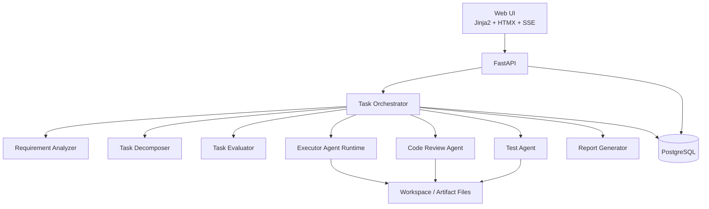

# AI 任务执行系统开发方案蓝图

## 1. 文档目标

本文档用于定义一套包含 UI 的 AI 任务执行系统的开发方案蓝图，重点解决以下问题：

- 用户通过 UI 提交任务提示词并查看执行过程。
- 后端通过受控 Agent 流程执行任务，而不是让 Agent 自由发散。
- 系统能够对需求进行澄清、对任务进行拆解、对子任务进行并行执行。
- 每个子任务都必须经过代码审查和测试，只有测试通过才算完成。
- 子任务执行过程需要被实时监听，并把日志和状态反馈到 UI。
- 在方案设计上尽量减少三方组件使用，优先选择可自建、可控、易维护的架构。

本文档面向 MVP 和第一阶段落地，不追求一开始覆盖所有通用任务类型，优先支撑“研发类任务”。

## 2. 设计原则

### 2.1 核心原则

- 编排优先：系统由统一 Orchestrator 管控，Agent 只是流程中的智能能力单元。
- 状态优先：所有关键步骤都必须有状态记录、可恢复、可重试。
- 审核优先：执行结果必须经过 Review 和 Test 两道关。
- 人工兜底：需求不清、重试失败、权限不足时要能中断并等待人工处理。
- 依赖收敛：优先单体架构和数据库驱动，避免过早引入复杂中间件。

### 2.2 减少三方组件的落地策略

首版不引入以下组件：

- 不引入工作流引擎，如 Temporal。
- 不引入消息总线，如 Kafka、RabbitMQ。
- 不引入对象存储，如 MinIO。
- 不引入向量数据库。
- 不引入多服务拆分。

首版只保留：

- `FastAPI`：提供 API、SSE、Agent 编排、Worker 管理。
- `PostgreSQL`：承担主数据存储、任务队列表、事件日志、状态恢复。
- `Jinja2 + HTMX + SSE`：实现轻量 UI，减少前后端分离成本。
- `Docker`：仅用于任务执行沙箱，非必须可延后。

说明：

- 如果首版不要求严格隔离，可先不启用 Docker，先用本机工作目录沙箱。
- 如果任务吞吐不高，可先不使用 Redis，使用 PostgreSQL 的任务表轮询与锁机制完成调度。

## 3. 目标范围

### 3.1 MVP 必须支持

- 创建任务。
- 展示任务列表和详情。
- 对原始提示词进行需求解析。
- 发现歧义并生成补充问题。
- 接收用户补充信息并继续执行。
- 将任务拆解为多个子任务。
- 为子任务分配执行 Agent。
- 并行执行无依赖子任务。
- 对每个子任务执行 Review 和 Test。
- 测试失败后自动回流修复。
- 生成最终执行报告。
- UI 实时展示任务状态、子任务状态、日志。
- 可配置模型、超时、重试次数、并发数。

### 3.2 MVP 暂不支持

- 跨项目知识库检索。
- 多租户隔离。
- 复杂权限域管理。
- 自动联网搜索。
- 动态下载和安装外部 Skill 包。
- 超大规模分布式任务调度。

## 4. 系统定位

本系统不是聊天机器人，而是“可控的 AI 任务执行平台”。其主要特征如下：

- 有明确任务生命周期。
- 任务执行由后端流程驱动。
- Agent 输出必须结构化。
- 所有关键节点都可追踪、可回放、可审计。
- 子任务的完成标准是“产物可用且测试通过”，不是“模型声称已完成”。

## 5. 总体架构

### 5.1 低依赖总体架构



### 5.2 模块划分

- `web`：HTML 页面、表单、任务列表、详情、日志视图、配置页。
- `api`：REST API、SSE 事件流、任务控制接口。
- `orchestrator`：状态机、任务推进、依赖调度、失败恢复。
- `agents`：需求解析、任务拆解、评估、执行、Review、Test、Report。
- `worker`：后台任务轮询、子任务执行、重试控制。
- `storage`：数据库访问层、文件产物读写。
- `domain`：任务模型、事件模型、策略模型。

## 6. 关键执行流程

### 6.1 主任务流程

```text
CREATED
-> REQUIREMENT_ANALYZING
-> WAITING_USER_INPUT (如有歧义)
-> TASK_DECOMPOSING
-> TASK_EVALUATING
-> SUBTASK_DISPATCHING
-> SUBTASK_RUNNING
-> REPORTING
-> COMPLETED / FAILED / PARTIAL_SUCCESS
```

### 6.2 单个子任务流程

```text
PENDING
-> READY
-> RUNNING
-> REVIEWING
-> TESTING
-> COMPLETED

失败分支：
RUNNING / REVIEWING / TESTING
-> RETRY_PENDING
-> RUNNING

达到阈值：
-> NEEDS_HUMAN_REVIEW
```

### 6.3 需求不明确流程

1. 用户提交原始提示词。
2. Requirement Analyzer 输出结构化结果：
   - 目标
   - 输入
   - 输出
   - 范围
   - 约束
   - 验收标准
   - 缺失信息
3. 如果 `缺失信息` 非空，则生成澄清问题。
4. 主任务状态变为 `WAITING_USER_INPUT`。
5. 用户在 UI 补充需求后，重新进入 `REQUIREMENT_ANALYZING`。

### 6.4 子任务并行流程

1. Task Decomposer 生成子任务列表和依赖关系。
2. Task Evaluator 为每个子任务生成执行策略。
3. Orchestrator 找出所有 `READY` 节点。
4. Worker 并行领取子任务。
5. 子任务结束后更新依赖节点状态。
6. 新满足依赖的子任务转为 `READY`。

## 7. Agent 体系设计

### 7.1 Agent 清单

| Agent | 作用 | 典型输入 | 典型输出 |
|---|---|---|---|
| Requirement Analyzer | 解析需求，发现歧义 | 原始提示词、历史补充信息 | 结构化需求、补充问题 |
| Task Decomposer | 拆解任务 | 结构化需求 | 子任务列表、依赖 DAG |
| Task Evaluator | 评估执行策略 | 子任务内容、环境配置 | Agent 模板、Skill、超时、重试策略 |
| Executor Agent | 执行具体子任务 | 子任务上下文、依赖产物 | 代码、文档、命令结果 |
| Code Review Agent | 代码质量检查 | 改动内容、上下文 | 问题列表、风险、修复建议 |
| Test Agent | 执行测试与分析失败原因 | 代码、测试命令、环境 | 测试结果、日志、失败摘要 |
| Report Agent | 汇总报告 | 任务全链路数据 | 最终报告 |

### 7.2 动态子 Agent 机制

动态子 Agent 不采用“自由生成”的方式，而采用“模板实例化”：

`子 Agent = AgentTemplate + SkillBinding + RuntimeConfig + TaskContext`

示例模板：

- `frontend_executor`
- `backend_executor`
- `test_fix_executor`
- `doc_executor`

说明：

- 模板控制角色和行为边界。
- Skill 控制工具能力。
- RuntimeConfig 控制模型、步数、超时、温度。
- TaskContext 控制任务目标、依赖和验收标准。

### 7.3 Skill 机制

首版 Skill 不做远程安装，采用本地注册表：

| Skill | 说明 |
|---|---|
| `read_repo` | 读取仓库结构和文件 |
| `edit_file` | 修改文件 |
| `run_command` | 运行命令 |
| `run_tests` | 执行测试命令 |
| `generate_report` | 生成报告 |

Skill 元数据建议：

- `skill_id`
- `name`
- `description`
- `allowed_tools`
- `allowed_file_scope`
- `default_timeout_sec`
- `supported_task_types`

## 8. 低依赖技术选型

### 8.1 推荐栈

| 层级 | 方案 | 选择原因 |
|---|---|---|
| UI | Jinja2 + HTMX + SSE | 不需要独立前端工程，页面交互足够，维护成本低 |
| API/编排 | FastAPI | Python 生态适合 Agent 编排和命令执行 |
| 数据库 | PostgreSQL | 一套组件承担主存储、任务表、事件表、状态恢复 |
| 后台执行 | FastAPI 同仓 Worker 进程 | 不引入 Celery、Temporal |
| 文件产物 | 本地文件系统 | 首版简单直接 |
| 沙箱 | 本地工作目录或 Docker | 可按安全要求逐步增强 |

### 8.2 不建议首版采用

- `Next.js + 独立前端服务`
- `Temporal`
- `Celery + Redis + Flower`
- `Kafka / RabbitMQ`
- `Elasticsearch`
- `向量数据库`

原因不是它们不好，而是当前目标是尽快做出一套可控、能跑通全链路的系统。

## 9. 后端模块设计

### 9.1 API 层

职责：

- 接收创建任务请求。
- 提供任务列表、详情、日志查询接口。
- 接收用户补充需求。
- 提供环境配置接口。
- 提供 SSE 日志订阅接口。

### 9.2 Orchestrator

职责：

- 驱动主任务状态流转。
- 驱动子任务状态流转。
- 判断何时需要用户输入。
- 判断何时可以分发子任务。
- 触发 Review/Test/Retry。
- 在所有子任务完成后触发报告生成。

### 9.3 Worker

职责：

- 轮询 `sub_tasks` 中状态为 `READY` 的记录。
- 加锁领取任务。
- 执行 Agent 调用。
- 写入日志和执行产物。
- 更新任务状态。

实现建议：

- 首版用单独 Python 进程运行 `while true` 轮询。
- 使用 PostgreSQL `FOR UPDATE SKIP LOCKED` 实现安全抢占。
- 并发数通过配置控制。

### 9.4 Event Logger

职责：

- 把每个关键动作写入 `task_events` 表。
- 供 UI 日志页面和 SSE 推送使用。

事件示例：

- `task.created`
- `requirement.analysis.started`
- `requirement.clarification.requested`
- `task.decomposed`
- `subtask.ready`
- `subtask.started`
- `subtask.review.failed`
- `subtask.test.failed`
- `subtask.retrying`
- `task.report.generated`

## 10. 数据库设计

### 10.1 表清单

- `tasks`
- `task_requirements`
- `clarification_rounds`
- `sub_tasks`
- `sub_task_dependencies`
- `agent_runs`
- `task_events`
- `artifacts`
- `env_profiles`
- `task_reports`

### 10.2 `tasks`

建议字段：

| 字段 | 类型 | 说明 |
|---|---|---|
| `id` | uuid | 主键 |
| `title` | varchar | 任务标题 |
| `prompt` | text | 原始提示词 |
| `status` | varchar | 主任务状态 |
| `current_phase` | varchar | 当前阶段 |
| `env_profile_id` | uuid | 环境配置 |
| `created_at` | timestamptz | 创建时间 |
| `updated_at` | timestamptz | 更新时间 |
| `completed_at` | timestamptz | 完成时间 |

### 10.3 `task_requirements`

| 字段 | 类型 | 说明 |
|---|---|---|
| `id` | uuid | 主键 |
| `task_id` | uuid | 关联任务 |
| `goal` | text | 目标 |
| `scope` | text | 范围 |
| `inputs_json` | jsonb | 输入定义 |
| `outputs_json` | jsonb | 输出定义 |
| `constraints_json` | jsonb | 约束 |
| `acceptance_json` | jsonb | 验收标准 |
| `missing_info_json` | jsonb | 缺失信息 |
| `version` | int | 版本号 |

### 10.4 `clarification_rounds`

| 字段 | 类型 | 说明 |
|---|---|---|
| `id` | uuid | 主键 |
| `task_id` | uuid | 关联任务 |
| `questions_json` | jsonb | 待澄清问题 |
| `answers_json` | jsonb | 用户补充信息 |
| `status` | varchar | `pending/answered` |
| `created_at` | timestamptz | 创建时间 |

### 10.5 `sub_tasks`

| 字段 | 类型 | 说明 |
|---|---|---|
| `id` | uuid | 主键 |
| `task_id` | uuid | 主任务 ID |
| `name` | varchar | 子任务名 |
| `description` | text | 子任务说明 |
| `status` | varchar | 子任务状态 |
| `priority` | int | 优先级 |
| `agent_template` | varchar | 使用的 Agent 模板 |
| `skill_bindings_json` | jsonb | Skill 列表 |
| `acceptance_json` | jsonb | 子任务验收标准 |
| `retry_count` | int | 已重试次数 |
| `max_retries` | int | 最大重试次数 |
| `timeout_sec` | int | 超时秒数 |
| `started_at` | timestamptz | 开始时间 |
| `completed_at` | timestamptz | 完成时间 |

### 10.6 `sub_task_dependencies`

| 字段 | 类型 | 说明 |
|---|---|---|
| `id` | uuid | 主键 |
| `task_id` | uuid | 主任务 ID |
| `from_sub_task_id` | uuid | 前置任务 |
| `to_sub_task_id` | uuid | 后置任务 |

### 10.7 `agent_runs`

| 字段 | 类型 | 说明 |
|---|---|---|
| `id` | uuid | 主键 |
| `task_id` | uuid | 主任务 ID |
| `sub_task_id` | uuid | 子任务 ID，可空 |
| `agent_type` | varchar | Agent 类型 |
| `model` | varchar | 使用模型 |
| `status` | varchar | 执行状态 |
| `input_json` | jsonb | 输入 |
| `output_json` | jsonb | 输出 |
| `started_at` | timestamptz | 开始时间 |
| `completed_at` | timestamptz | 结束时间 |

### 10.8 `task_events`

| 字段 | 类型 | 说明 |
|---|---|---|
| `id` | bigserial | 主键 |
| `task_id` | uuid | 主任务 ID |
| `sub_task_id` | uuid | 子任务 ID，可空 |
| `event_type` | varchar | 事件类型 |
| `level` | varchar | `info/warn/error` |
| `message` | text | 日志消息 |
| `payload_json` | jsonb | 扩展数据 |
| `created_at` | timestamptz | 时间 |

### 10.9 `artifacts`

| 字段 | 类型 | 说明 |
|---|---|---|
| `id` | uuid | 主键 |
| `task_id` | uuid | 主任务 ID |
| `sub_task_id` | uuid | 子任务 ID，可空 |
| `type` | varchar | `code/report/log/test_output` |
| `path` | text | 文件路径 |
| `summary` | text | 摘要 |
| `created_at` | timestamptz | 创建时间 |

### 10.10 `env_profiles`

| 字段 | 类型 | 说明 |
|---|---|---|
| `id` | uuid | 主键 |
| `name` | varchar | 配置名称 |
| `default_model` | varchar | 默认模型 |
| `review_model` | varchar | Review 模型 |
| `test_model` | varchar | Test 模型 |
| `max_concurrency` | int | 最大并发 |
| `default_timeout_sec` | int | 默认超时 |
| `max_retries` | int | 最大重试次数 |
| `enable_auto_sub_agents` | boolean | 是否启用动态子 Agent |

### 10.11 `task_reports`

| 字段 | 类型 | 说明 |
|---|---|---|
| `id` | uuid | 主键 |
| `task_id` | uuid | 主任务 ID |
| `report_markdown` | text | Markdown 报告 |
| `summary_json` | jsonb | 结构化摘要 |
| `created_at` | timestamptz | 创建时间 |

## 11. 接口设计

### 11.1 任务接口

`POST /api/tasks`

请求：

```json
{
  "title": "实现一套任务执行系统",
  "prompt": "根据需求实现包含 UI 的 AI 任务执行系统",
  "env_profile_id": "uuid"
}
```

`GET /api/tasks`

支持参数：

- `status`
- `page`
- `page_size`

`GET /api/tasks/{task_id}`

返回：

- 任务基本信息
- 结构化需求
- 当前澄清问题
- 子任务列表
- 聚合进度

### 11.2 补充需求接口

`POST /api/tasks/{task_id}/clarifications/{round_id}/answer`

请求：

```json
{
  "answers": {
    "target_repo": "xxx",
    "preferred_stack": "python"
  }
}
```

### 11.3 子任务接口

`GET /api/tasks/{task_id}/subtasks`

`GET /api/subtasks/{sub_task_id}`

`POST /api/subtasks/{sub_task_id}/retry`

适用场景：

- 人工触发重试。
- 人工解除 `NEEDS_HUMAN_REVIEW`。

### 11.4 日志与事件接口

`GET /api/tasks/{task_id}/events`

`GET /api/tasks/{task_id}/stream`

说明：

- `events` 用于分页查询历史日志。
- `stream` 使用 SSE 推送实时事件。

### 11.5 配置接口

`GET /api/env-profiles`

`POST /api/env-profiles`

`PUT /api/env-profiles/{env_profile_id}`

## 12. UI 设计

### 12.1 页面结构

首版采用 4 个核心页面：

1. 任务列表页
2. 任务详情页
3. 日志页
4. 环境配置页

### 12.2 任务列表页

功能：

- 展示任务标题、状态、当前阶段、更新时间。
- 支持按状态筛选。
- 支持进入详情。
- 支持创建新任务。

### 12.3 任务详情页

模块建议：

- 基本信息区：标题、提示词、状态、时间。
- 需求解析区：目标、约束、输出、缺失信息。
- 澄清问答区：若有未回答问题，直接展示输入框。
- 子任务图区：展示树形列表或简化 DAG。
- 进度区：已完成数、失败数、进行中数。
- 产物区：代码、报告、测试输出链接。

### 12.4 日志页

展示内容：

- 主任务事件日志。
- 子任务执行日志。
- Review 日志。
- Test 日志。
- 重试历史。

交互要求：

- 默认实时滚动。
- 支持按子任务过滤。
- 支持按级别过滤。

### 12.5 环境配置页

配置项：

- 默认模型
- Review 模型
- Test 模型
- 默认超时
- 最大并发
- 最大重试次数
- 是否启用动态子 Agent
- 是否启用 Docker 沙箱

## 13. 调度与并发设计

### 13.1 调度模型

采用数据库驱动调度：

1. Orchestrator 更新子任务状态为 `READY`。
2. Worker 轮询 `READY` 子任务。
3. Worker 使用 `FOR UPDATE SKIP LOCKED` 抢占任务。
4. 执行完成后写回状态和日志。

### 13.2 并发控制

并发控制来源于两层：

- 全局并发：由 `env_profiles.max_concurrency` 控制。
- 任务级并发：单个任务同时运行的子任务数量可单独限制。

### 13.3 重试策略

每个子任务具备：

- `retry_count`
- `max_retries`
- `last_failure_reason`

建议规则：

- Review 失败：优先回流给 Executor 修正。
- Test 失败：把失败日志和测试输出喂回 Executor 修正。
- 连续超过最大重试次数：标记 `NEEDS_HUMAN_REVIEW`。

## 14. Review 与 Test 闭环

### 14.1 执行闭环

```text
Executor -> Code Review -> Test -> Passed
                         -> Failed -> Retry Executor
```

### 14.2 Review Agent 输出要求

必须结构化输出：

- 是否通过
- 问题列表
- 严重级别
- 修复建议
- 是否阻塞测试

### 14.3 Test Agent 输出要求

必须结构化输出：

- 是否通过
- 执行命令
- 关键日志
- 失败摘要
- 建议修复方向

### 14.4 自动修复输入拼装

回流给 Executor 的上下文必须包含：

- 原始子任务目标
- 当前代码差异
- Review 问题
- Test 失败摘要
- 上一轮尝试记录

这样才能避免 Agent 每轮都从零开始推理。

## 15. 报告设计

### 15.1 最终报告结构

- 任务摘要
- 需求确认过程
- 子任务拆解结果
- 执行过程概览
- 每个子任务结果
- Review 摘要
- Test 摘要
- 风险和遗留问题
- 最终产物清单

### 15.2 报告格式

首版输出 Markdown 即可，同时保存结构化摘要 JSON：

- Markdown 便于查看和导出。
- JSON 便于后续做统计和搜索。

## 16. 权限与安全

### 16.1 最小权限原则

- Agent 只能访问任务允许的工作目录。
- 命令执行必须通过白名单控制。
- 禁止默认联网。
- 高风险命令需显式审批。

### 16.2 沙箱策略

推荐分阶段：

第一阶段：

- 本地工作目录隔离。
- 命令白名单。

第二阶段：

- Docker 容器隔离执行。
- 限制 CPU、内存、超时。

## 17. 项目目录建议

```text
propagate/
  app/
    api/
    agents/
    orchestrator/
    workers/
    models/
    repositories/
    services/
    templates/
    static/
  docs/
    ai-task-execution-blueprint.md
  migrations/
  tests/
  scripts/
```

## 18. MVP 开发顺序

### 阶段一：平台骨架

目标：

- 建立 FastAPI 项目。
- 建立 PostgreSQL 数据表。
- 完成任务创建、列表、详情页面。
- 完成事件日志表和 SSE 输出。

交付：

- 能创建任务。
- 能查看任务状态。
- 能实时看到日志。

### 阶段二：需求解析与澄清

目标：

- 接入 Requirement Analyzer。
- 支持 `WAITING_USER_INPUT`。
- 支持用户补充需求并重新分析。

交付：

- 能形成结构化需求。
- 能触发澄清问答流程。

### 阶段三：任务拆解与执行

目标：

- 接入 Task Decomposer。
- 生成子任务与依赖关系。
- Worker 能并行执行 `READY` 子任务。

交付：

- 能看到子任务树。
- 能并行执行子任务。

### 阶段四：Review/Test 闭环

目标：

- 接入 Review Agent 和 Test Agent。
- 支持失败回流和自动重试。
- 支持失败升级为人工处理。

交付：

- 子任务完成标准变为“测试通过”。

### 阶段五：报告与打磨

目标：

- 汇总最终报告。
- 打磨 UI、日志、筛选和搜索能力。

交付：

- 整体链路闭环完成。

## 19. 风险与应对

### 19.1 风险：Agent 输出不稳定

应对：

- 强制结构化输出。
- 对关键输出做 schema 校验。
- 校验失败直接重试或降级人工。

### 19.2 风险：没有工作流引擎导致状态复杂

应对：

- 首版状态机保持简单。
- 所有状态变化统一走 Orchestrator。
- 严禁各模块私自改状态。

### 19.3 风险：不用消息队列导致吞吐有限

应对：

- MVP 阶段接受有限吞吐。
- 后续可无痛引入 Redis 或专用队列。

### 19.4 风险：本地文件存储不适合扩展

应对：

- 先用本地文件系统。
- 抽象 `ArtifactStore` 接口，后续可替换成 S3。

## 20. 结论

本方案建议首版采用“单体应用 + PostgreSQL + 内置状态机 + SSE + 本地文件产物”的低依赖架构，优先做通任务链路、状态控制、Review/Test 闭环和 UI 可视化，而不是过早引入复杂的分布式基础设施。

这条路线的优势是：

- 组件少，部署简单。
- 开发路径短，容易先做出可运行系统。
- 状态清晰，便于调试和审计。
- 后续若任务规模扩大，可以逐步替换单点模块，而不需要推翻整体设计。

## 21. 下一步建议

建议按以下顺序继续推进：

1. 输出数据库建表设计 SQL。
2. 输出后端模块骨架与目录结构。
3. 输出核心 API OpenAPI 草案。
4. 输出任务详情页和日志页原型。

